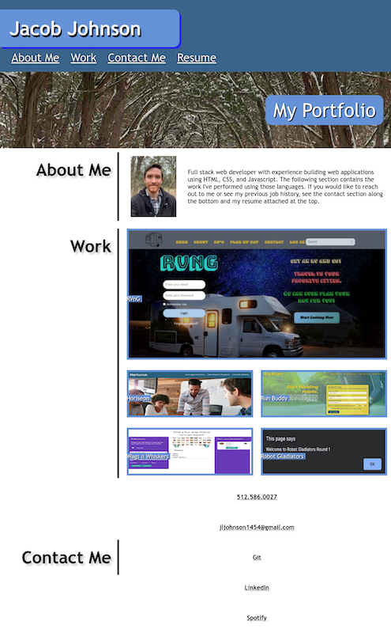

# My Porfolio
### Created using React
 
 

## Description
This is an application with links to several of my projects as a developer. The original portfolio was created using HTML and CSS, but I created this one with React by refactoring my existing files and importing them into React. I deployed the application using both Github Pages and Heroku (just in case).
 
 

## Links
Deployed App: https://jljohnson1454.github.io/react-portfolio/ or https://sheltered-plateau-98685.herokuapp.com/
 
 
Github:https://github.com/jljohnson1454/react-portfolio
 
 

## Installation
Once downloaded be sure to use 'npm i' in your commande console to download the dependencies. From there simply enter 'npm start' and a react page should generate.
 
 

## Usage
Screenshot:
 
 

 
 

## Contributors
Application created by Jacob Johnson
 
 

## License
MIT